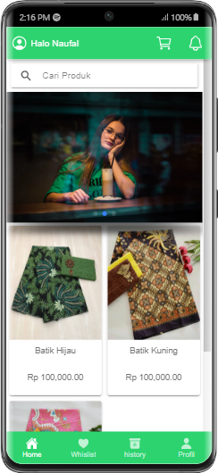
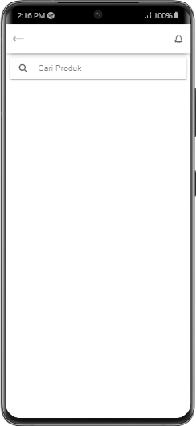
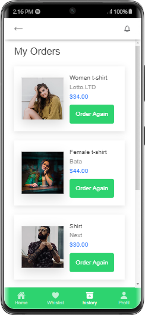

# Aplikasi toko online ionic 7 dan laravel
Aplikasi laravelnya  ada di sini 
<a href='https://github.com/gudangcoding/simple-shop'> Simple shop</a> 
<h3>cara install</h3>
<ol>
    <li>Install node js</li>
    <li>Install ionic cli</li>
    <li>Jalankan Perintah <pre>npm update --force or --legacy-peer-deps</pre> di cmd</li>
</ol>

